# Structured Exception Handling and Validating Exception Chains with SEHOP
*Notice*: Originally based off notes from [llan-OuO](https://github.com/llan-OuO).
---
>  Ensures the integrity of an exception chain during dispatch. - Microsoft

Structured Exception Handling (SEH) is an extension to the C and C++ languages provided by Microsoft. This extension allows programmers to handle both hardware and software exceptions natively in C which does not normally have exception handling functionality. Although SEH may be used in C++ it is suggested by Microsoft that you use the ISO-Standard exception handling native to C++ due to some unexpected behavior related to class destructors not being called if you use SEH [5].

There are two common protections applied to SEH chains, SafeSEH, which we discuss in a [separate writeup](https://github.com/daintyjet/VChat_SAFESEH), and SEHOP, which we discuss here. The primary goal of both exploit mitigation techniques is to detect when a program overwrites the SEH entries - which should not happen during a normal program's execution - and exit to prevent the malicious actor for gaining control over the flow of execution by arbitrarily overwriting the SEH entry and triggering an exception to force the process to use the modified entry to execute arbitrary code.


## Structured Exception Handler
SEH is Windows' exception handling mechanism used in C programs, this is implemented using a singly-linked list of SEH `_EXCEPTION_REGISTRATION_RECORD`S on the stack. This singly linked list is known as the SEH chain and each exception registration record corresponds to one exception that can be handled  in the current thread of the process. Each `_EXCEPTION_REGISTRATION_RECORD` contains two elements: a *NEXT* pointer, which contains the address of the next `_EXCEPTION_REGISTRATION_RECORD`, and a pointer *Handler* that contains the address of the exception handler, which is a function pointer that tells the program what code should be executed when the exception corresponding to this record is raised. Each of these SEH records is stored on the stack, which, considering we have been discussing stack-based buffer overflows, should be concerning. 


Below is the structure of a SEH `_EXCEPTION_REGISTRATION_RECORD`. As mentioned before, this is stored on the stack of the currently executing thread. In a 32-bit process, each of the pointers contained within is 4 bytes; in a 64-bit process, each pointer is 8 bytes. 

```
typedef struct _EXCEPTION_REGISTRATION_RECORD
{
  /* 0x0000 */ struct _EXCEPTION_REGISTRATION_RECORD* Next;
  /* 0x0008 */ void* Handler /* function */;
} EXCEPTION_REGISTRATION_RECORD, *PEXCEPTION_REGISTRATION_RECORD; /* size: 0x0010 */
```
> [!NOTE]
> Note the annotated sizes are for a 64-bit system as the [referenced](https://github.com/ntdiff/headers/blob/master/Win10_1507_TS1/x64/System32/hal.dll/Standalone/_EXCEPTION_REGISTRATION_RECORD.h) code is pertaining to a possibly 64-bit Windows-10 system, in a 32-bit system each pointer takes only 4-bytes rather than the 8-bytes a pointer in a 64-bit system would occupy. When an exception occurs, the OS will walk through the SEH chain and try to find a proper SEH that can handle the exception.
>
> You can also find a reference in [1].

The *Handler* in this points to a function *_except_handler* that is equivalent to the definition found in [6] listed below:
```c
typedef EXCEPTION_DISPOSITION (CDECL ExceptionHandler)(EXCEPTION_RECORD* ExceptionRecord, EXCEPTION_REGISTRATION* EstablisherFrame, CONTEXT* ContextRecord, DISPATCHER_CONTEXT* DispatcherContext); //same as EXCEPTION_ROUTINE and _except_handler
```

This handler can return one of the *Filter Expression* values described in [14]. That is it can return `EXCEPTION_CONTINUE_EXECUTION` (-1) if the exception is dismissed and we should instead continue execution, it may return `EXCEPTION_CONTINUE_SEARCH` (0) if our handler does not recognize the exception and the search should continue through the SEH chain, and finally it can return `EXCEPTION_EXECUTE_HANDLER` (1) if this SEH entry can handle the exception and has executed.

> [!NOTE]
> This creates a *Typedef* of a function pointer, this means the SEH handers will point to a function with the following signature:
>
> ```
>   CDECL ExceptionHandler (
>      EXCEPTION_RECORD* ExceptionRecord, 
>      EXCEPTION_REGISTRATION* EstablisherFrame, 
>      CONTEXT* ContextRecord, 
>      DISPATCHER_CONTEXT* DispatcherContext
>   );
> ```
> We can find the same - if using slightly different typedefs - structure in [11]

The [`_EXCEPTION_RECORD `](https://learn.microsoft.com/en-us/windows/win32/api/winnt/ns-winnt-exception_record) structure contained within provides information the system uses to determine if the currently raised exception can be handled by the current handler or if this will need to be propagated further down the chain. There are slight differences between the structures used in 32-bit and 64-bit programs compiled to use SEH as the requirements for describing an exception in ether may differ slightly.

```c
typedef struct _EXCEPTION_RECORD {
  DWORD                    ExceptionCode;
  DWORD                    ExceptionFlags;
  struct _EXCEPTION_RECORD *ExceptionRecord;
  PVOID                    ExceptionAddress;
  DWORD                    NumberParameters;
  ULONG_PTR                ExceptionInformation[EXCEPTION_MAXIMUM_PARAMETERS];
} EXCEPTION_RECORD;
```

When an SEH entry is used to resolve an exception the system will place the `EstablisherFrame` argument, which based on the structure of the SEH cahin is the second argument on the stack (Next SEH), and this will be placed onto the stack at `ESP+8` [11], this is why we use the SEH Gadget `POP POP RET` as our *Handler*; additionally the code for the *Handler* must not be located on the stack [15].

The first entry of the SEH Chain is contained in the Thread Information Block (TIB) which is also known as the Thread Environment Block (TEB) if we are in a 32-bit process. Below is the structure contained at the start of each (TEB) which has the first SEH entry which we start our search at. This
```c
typedef struct _NT_TIB
{
     PEXCEPTION_REGISTRATION_RECORD ExceptionList;
     PVOID StackBase;
     PVOID StackLimit;
     PVOID SubSystemTib;
     union
     {
          PVOID FiberData;
          ULONG Version;
     };
     PVOID ArbitraryUserPointer;
     PNT_TIB Self;
} NT_TIB, *PNT_TIB;
```
> [!NOTE]
> This is not a particularly well-documented structure when it comes to official Microsoft sources. So there are a few external sources [6][7][8][9], and even an official repository for using Rust to develop for Microsoft [10] which reference this structure. 

The **last entry** in the chain has a *Next* pointer that consists of all `0xF`. This means in a 32-bit process, the final entry will have a next pointer consisting of the address `0xFFFFFFFF`. This means our SEH chain will on it's own have the following structure:

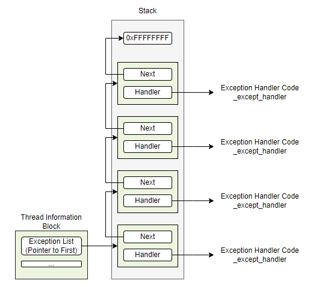

## SEHOP Implementation and Effects

> [!IMPORTANT]
> This is a *System-Wide* exploit mitigation; it is not enabled on a per-process basis. Though [additional granularity](https://learn.microsoft.com/en-us/windows/security/operating-system-security/device-management/override-mitigation-options-for-app-related-security-policies) is possible; additionally you can disable SEHOP on a [per process basis](https://msrc.microsoft.com/blog/2009/11/sehop-per-process-opt-in-support-in-windows-7/#:~:text=SEHOP%20can%20be%20enabled%20for%20a%20process%20by,0%20%28or%20disabled%20by%20setting%20it%20to%201%29.) using the Windows Registry.
>
> This setting is *enabled by default*

One of the protections Microsoft developed to mitigate the vulnerabilities of SEH is *Structured Exception Handling Overwrite Protection* (SEHOP). This mitigation technique does not require any modification to the binaries of an executable. Instead, this mitigation adds additional runtime checks to the exception dispatcher. When SEHOP is enabled the exception dispatcher verifies the integrity of a thread's exception chain in two steps [1]:

- When the processes is loaded and a thread starts executing a *symbolic exception registration* record is inserted at the end of the chain. Specifically this occurs when a thread starts to execute in the *user mode*.
- When an exception occurs in *user-mode* and the exception dispatcher is notified, it will walk through the SEH chain's linked list to determine if it can reach the symbolic record at the final entry of the SEH chain. If this symbolic entry cannot be reached, the SEH chain is considered to be corrupted and the exception dispatcher will terminate the process.

Below is a diagram to illustrate how SEHOP works. As the stack grows from a high address to a low address, and the Next pointer is allocated *above* the Handler pointer in the SEH record, in order to overwrite the Handler and control the EIP when an exception is raised, we must first overwrite the Next pointer. This breaks the SEH chain and we can no longer reach the *symbolic exception registration*  unless we overwrite the next pointer with the original address contained within; therefore if we use the `POP POP RETN` gadget to take full control of the EIP as discussed previously even if we were to overwrite the Next pointer with its original value this would not help us gain control over the system since we would be loading the original Next pointer value into the EIP register leading to a crashed system state. We may be able to use a `POP POP POP RETN` gadget if one exists instead.

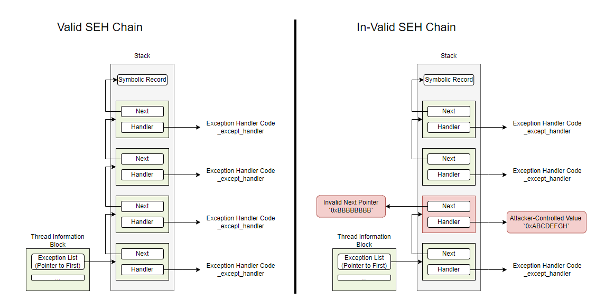

> [!NOTE]
> The image we created is based on the original image below.
>
> 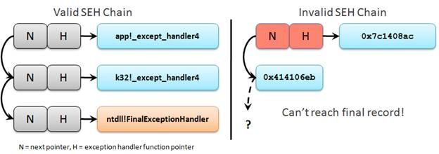

## Enabling and Disabling SEHOP
As this is a system-wide setting, there are multiple ways to enable and disable it. We will focus on the most straightforward method in the Windows Security Settings. This can be used to both enable and disable SEHOP on a system.

1. Open the Windows Settings page.

   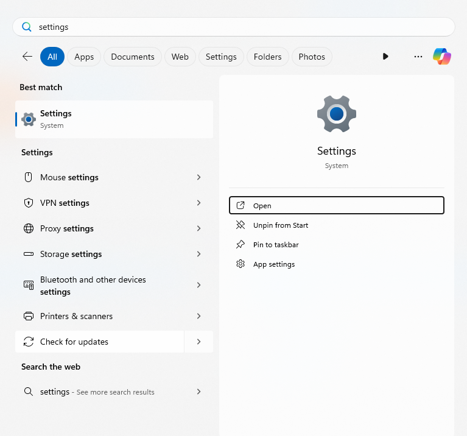

2. Access the Security Settings Page and *Open Windows Security*

   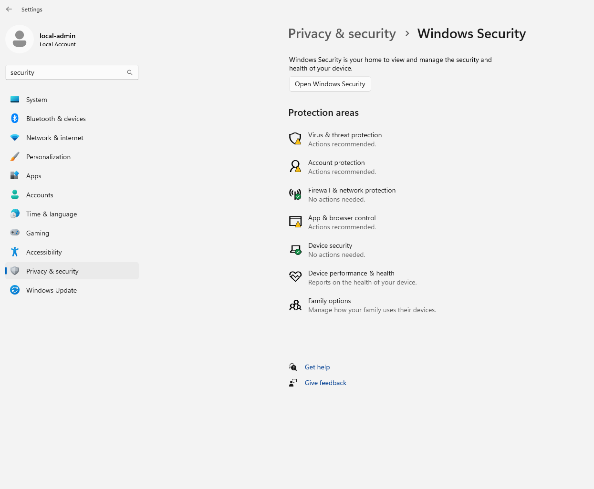

3. Access the *App & Browser Control*

   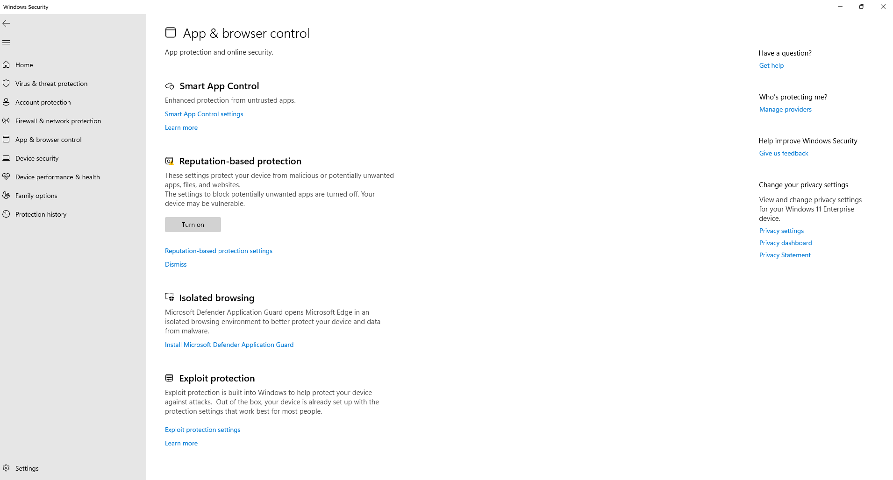

4. Open the *Exploit Protection* settings. Scroll Down till you can see the *Validate Exception Chains (SEHOP)* setting.

   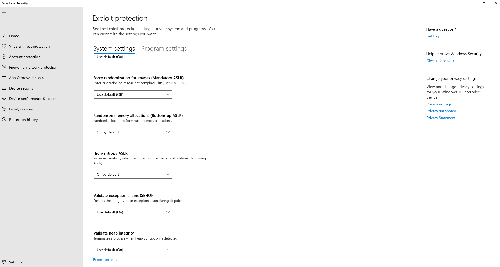

5. If you make a change, you will need to restart the device.

   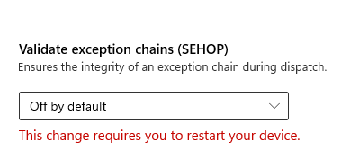


## Standalone Program Exploration
This section explores SEHOP using a standalone program. We will examine the behavior of SEH when SEHOP is both enabled and disabled, and then we will do the same with the VChat program. It should be noted that the standalone program can take user input, but we will modify the stack using the debugger for simplicity.

> [!NOTE]
> The program we are using is a modified version of the example program in [14]

### Initial Exploration
1. Enable SEHOP and restart your machine using the instructions in the above [Enabling and Disabling SEHOP](#enabling-and-disabling-sehop) section. Then, you will repeat this with SEHOP disabled.
2. Open the [`SEHOP-Standalone`](./SRC/SEHOP-Standalone/SEHOP-Standalone.sln) project.
3. Uncomment both of the preprocessor definitions included in the program.
   * `#define INT`: Compile the program with pre-placed interrupt instructions to trigger breakpoints in the debugger.
   * `#define UNSAFE`: Include and compile the `scanf(...)` statement that allows us to overwrite the SEH chain entry.
4. Open Immunity Debugger and Attach the Standalone Program.

   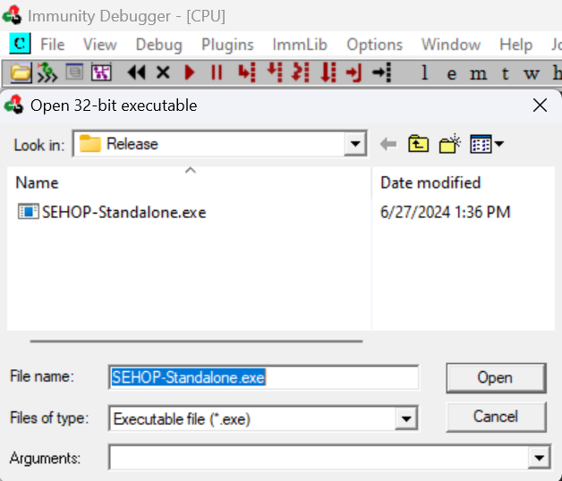

5. Click run and observe the stack.

   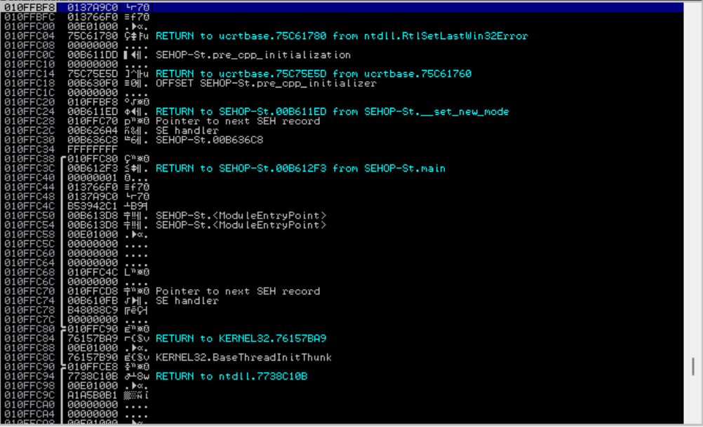

6. Examine the security features applied to our executable using `!mona mod`. Notice that we will not see SEHOP as this is a system-based security feature.

   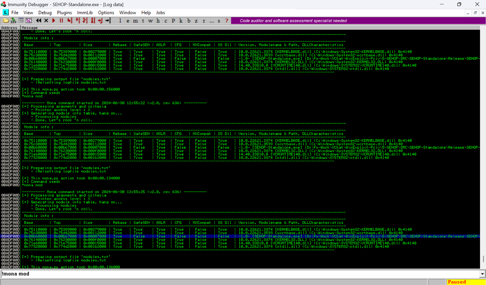

7. Open the SEH Chain viewer in Immunity Debugger, you can also use the keybind `Alt+S`.

   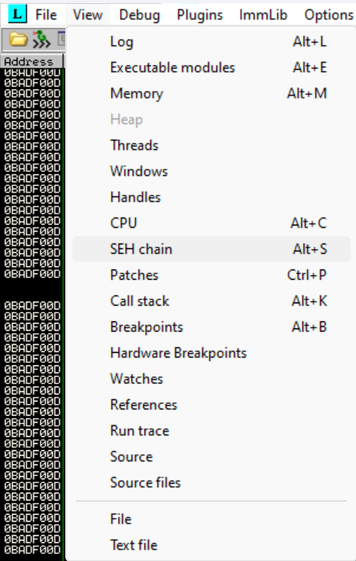

8. Take note of the SEH Chain locations.

   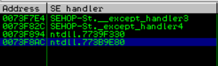

9. Locate the Local SEH record, this is included in this program because we have a local try-catch block in the *main* function.

   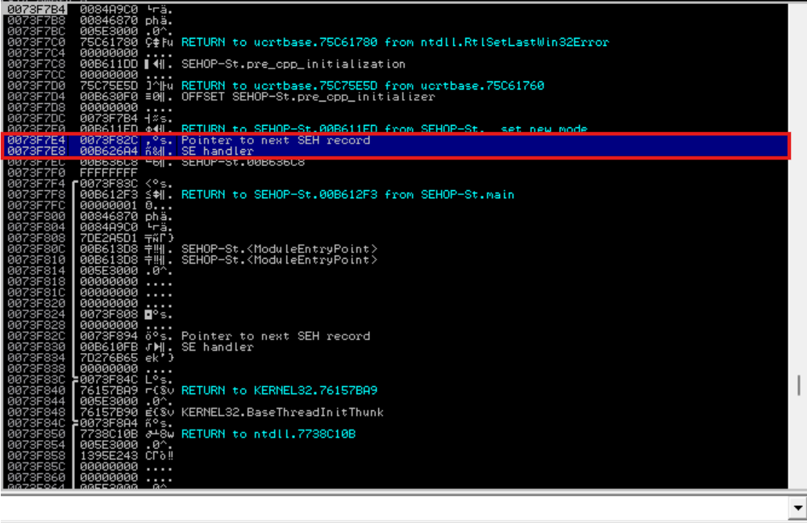

10. Locate the next two SEH entries on the stack using the `Pointer to next SEH record` (Next pointer) in the seh Entries.

   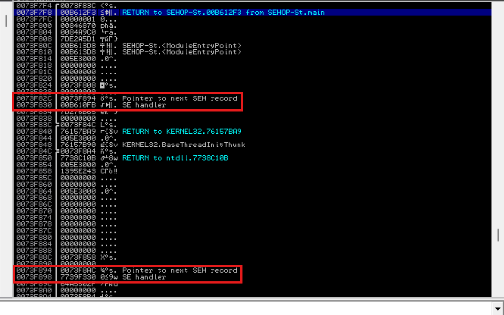

11. Click Run again. You should be prompted for user input in the terminal Immunity Debugger opened when the program was attached/launched. Provide some kind of user input in the terminal. As we will be using the debugger to manually edit the stack values in this example program, the contents of the input do not matter too much. However, since this does take user input, we could write a program to inject shellcode.

   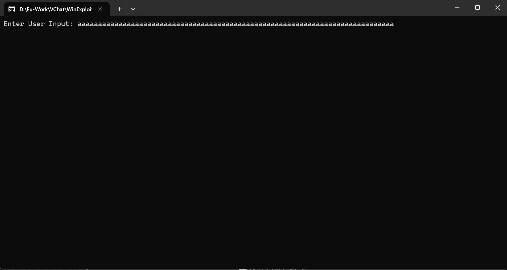

12. Observe the SEH record for the local handler being overwritten.

   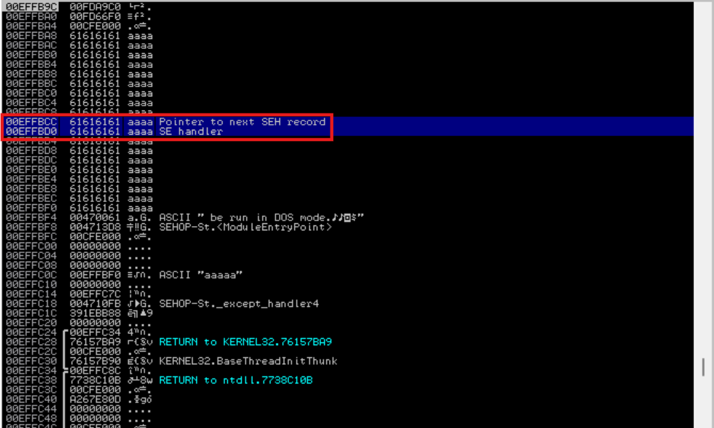


### Observe SEH Handler Pointer Behavior
1. First, Select an instruction or sequence of instructions and copy the address where they are located. This should be done from the CPU window.

   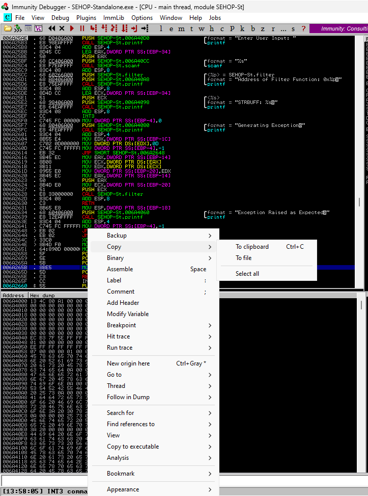

   * This will be used as a target rather than the default handler. In this case, I chose the function epilog of the main function
2. Place this address in the `SE Handler` entry for the local SEH handler. We do this by right-clicking and selecting *Modify* on the entry in the stack view. Input the Hexadecimal address of the instruction. (Save this address for future use)

   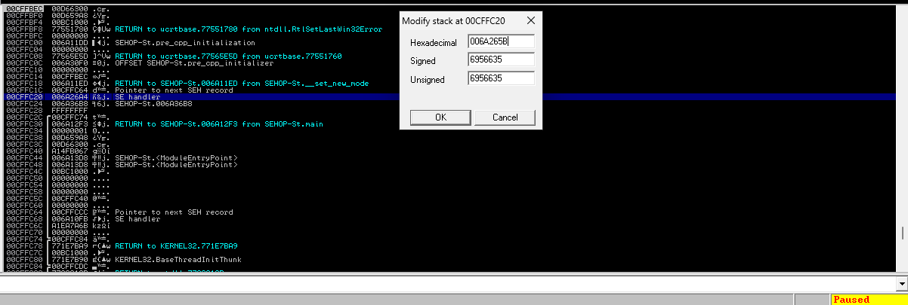

3. Open the SEH Chain viewer again, you can use `Alt + S`.

   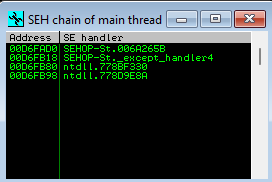

   * Notice how the chain is still intact, we have not broken the tail end of the chain with an invalid or corrupted entry.
4. Set a breakpoint at the address we chose to point the SEH handler to and step through the program. When the exception is raised, pass it to the standalone program. Notice that we successfully jumped to our target address as the breakpoint is hit.

   https://github.com/DaintyJet/VChat_SEH/assets/60448620/01cb5545-d275-4477-9a23-4f1ddc1c3899

   * The behavior is expected since we have not broken the SEH chain yet.

### Observe SEH Next Pointer Behavior
1. Restart the program, and instead of placing the address we chose in the previous section in the `SE Handler` field, we will place it in the `Pointer to Next SEH Record` field.

   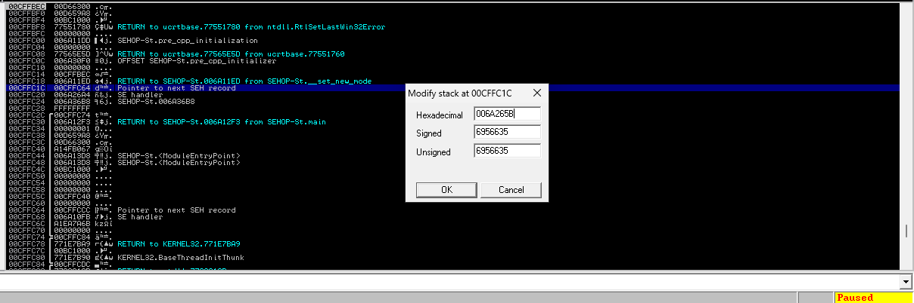

2. Open the SEH Chain Viewer again, we can use the `Alt + S` keybind.

   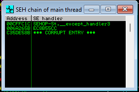

   * Notice how we do not have a Corrupted Entry. This means we can no longer traverse the entire chain as it will fail once it reaches the *Corrupt Entry*.
3. Now we will find a replacement for the `SE Handler` field. Right-click the CPU window and select `Search For` -> `Sequence of Commands`. Input the following values to find two `POP` instructions followed by a `RETN`.

   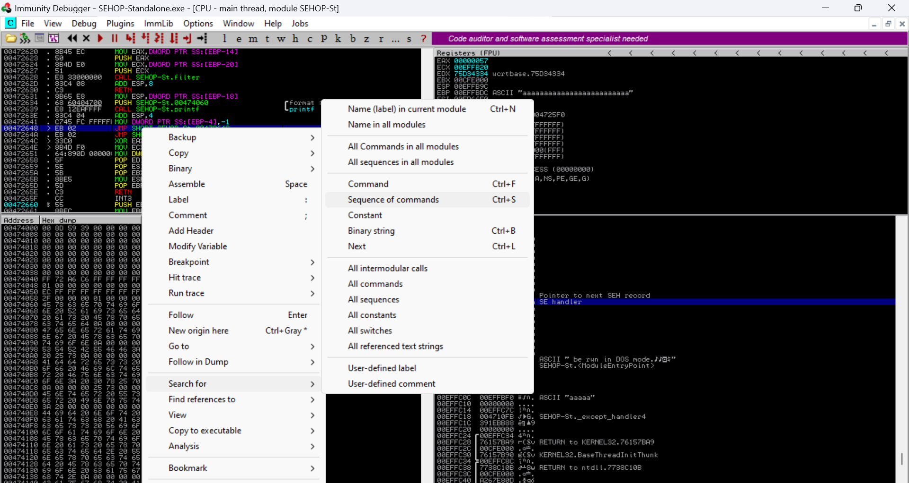

   ```
   POP R32
   POP R32
   RETN
   ```
4.  Copy the address of the first instruction in the sequence. We will use this as our new handler target as this is what most SEH exploits use to gain control over the flow of execution and jumping to the stack.

   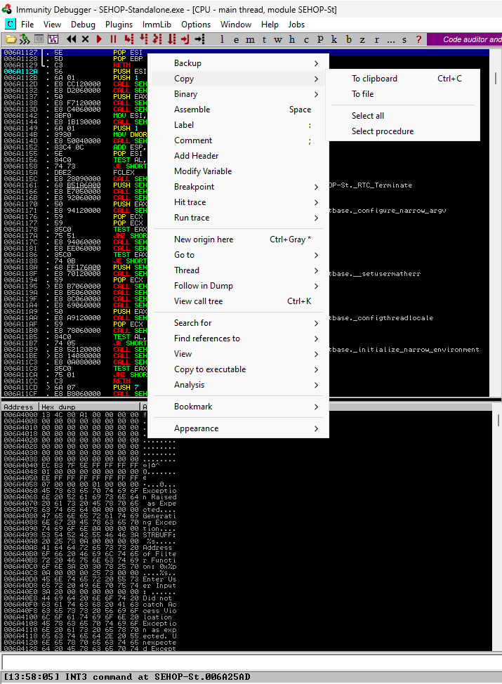

5.  Modify the `SE Handler` pointer and replace it with the address of the `POP POP RETN` gadget we located earlier.

   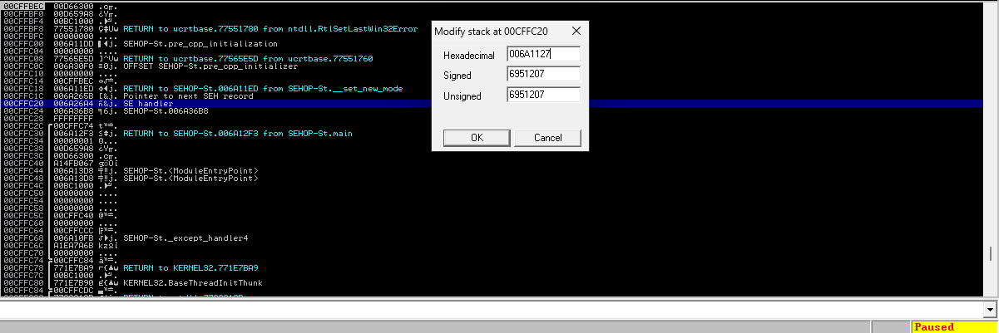

6.  Set a breakpoint at the `POP POP RETN` instruction gadget.

   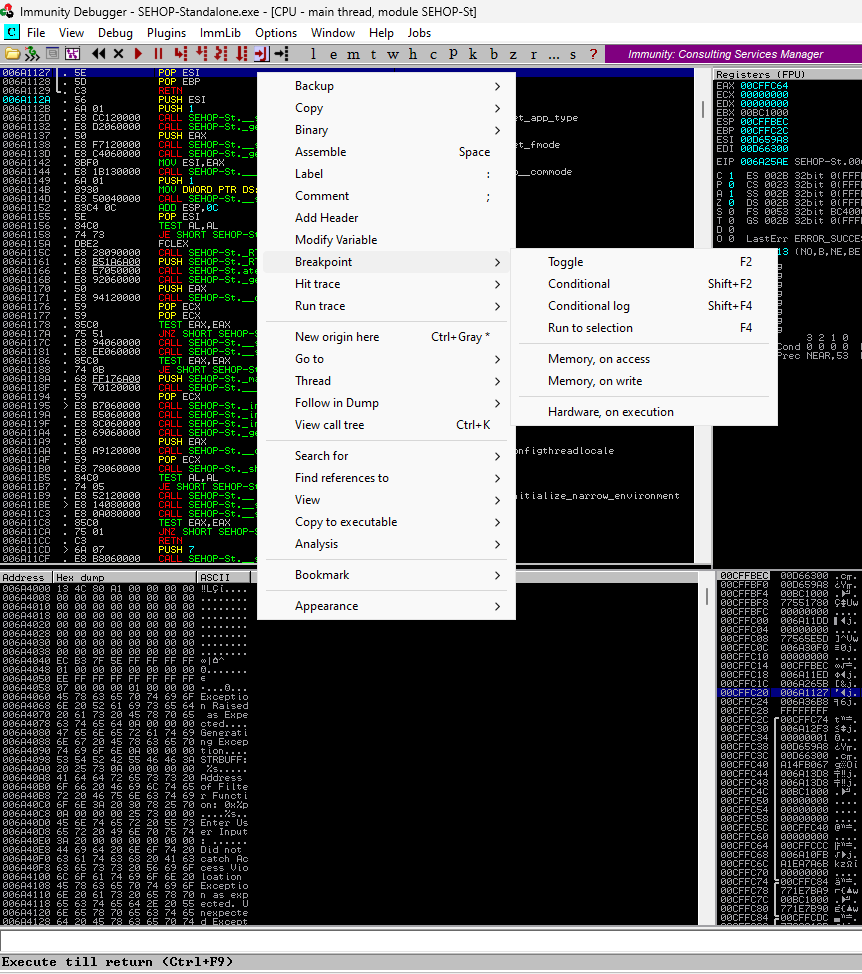

7.  Run the program until an exception is thrown, you will see a request to pass the exception to the program in the bottom left. Remember you will again need to provide input in the terminal window when requested in order to continue executaion.

   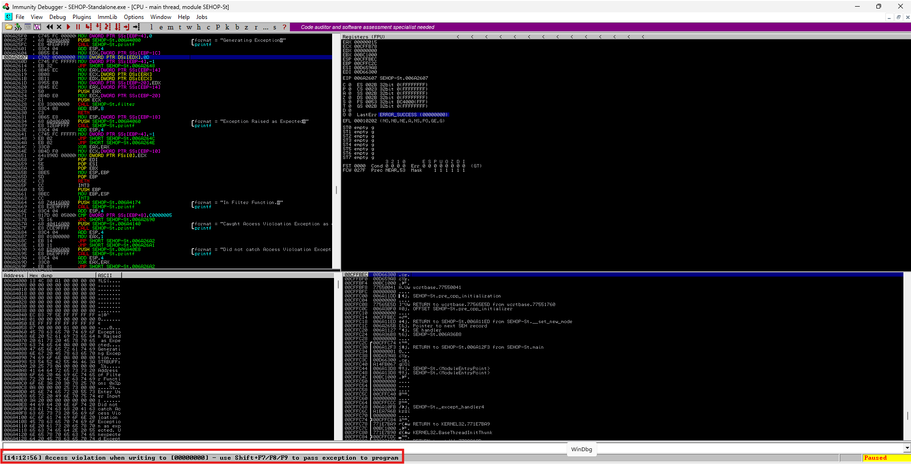

8.  Pass the exception to the program with `Shift + f7` or one of the other keybinds offered. 

   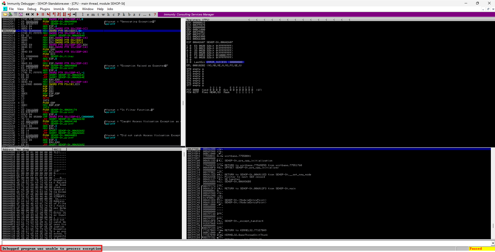

    * Notice how we did not hit the breakpoint at the gadget! This is because we broke the SEH chain and SEHOP is enabled, meaning the exception handler was unable to traverse the end of the chain and could not find the symbolic entry; therefore it raised an exception.

  https://github.com/DaintyJet/VChat_SEH/assets/60448620/362c7ced-ffd9-4925-8e52-afb00919d5ee

11. Disable SEHOP based on the instructions in the [Enabling and Disabling SEHOP](#enabling-and-disabling-sehop) section and repeat!

> [!NOTE]
> You can replace the `Pointer to Next SEH Record` with a later entry in the SEH chain; for example, we could look at a valid entry for the current SEH record and go to the Next record. We can then replace the current record with the `Pointer to Next SEH Record` from the next record.
>
> This does not help much with the SEH exploit which uses the `POP POP RETN` gadget, but it is something that is interesting.


> [!IMPORTANT]
> To see this behavior, you can simply replace the `Pointer to Next SEH Record` with a random value. It does not even need to be the SEH entry we are overwriting. If we overwrite the `Pointer to Next SEH Record` of a later SEH record the check will still fail. (SEHOP requires the entire chain of `Pointer to Next SEH Record` be preserved)
## VChat Exploration
As we will be enabling a system-wide setting, we will not be affecting the VChat code itself, in order to explore the effects this option has of VChat you should do the following.

1. Enable SEHOP using the instructions in the [Enabling and Disabling SEHOP](#enabling-and-disabling-sehop) setting.
2. Preform the [SEH Exploit on the GMON command](https://github.com/DaintyJet/VChat_GMON_SEH) with SEHOP Enabled.

## SafeSEH
SafeSEH is a mitigation strategy that can be applied to application to help mitigate overflows that leverage the SEH chin to gain control over the flow of execution. Unlike SEHOP, this mitigation is applied on a per-application basis at compiled time as this mitigation generates a table of valid exception handlers the SEH Entries can contain. At the time of writing there is no way to generate this table for a program to use once the application binary has been generated. As SafeSEH can only be applied to programs at compile time this means we cannot protect already existing programs unless we re-compile them with SafeSEH enabled. Additionally its inability to protect handlers that points to an external functions or module that do not support SafeSEH is an additional limitation. This is why SafeSEH although powerful is considered to be a weaker protection than SEHOP due to these limitations. 

The SafeSEH table is generated by the linker during the compilation process, per the Microsoft reference [16] this replies on using the C standard library. If you are not using the C standard library you can include the following code [16]:
```c
#include <windows.h>
extern DWORD_PTR __security_cookie;  /* /GS security cookie */

/*
* The following two names are automatically created by the linker for any
* image that has the safe exception table present.
*/

extern PVOID __safe_se_handler_table[]; /* base of safe handler entry table */
extern BYTE  __safe_se_handler_count;  /* absolute symbol whose address is
                                           the count of table entries */
typedef struct {
    DWORD       Size;             // Size of structure
    DWORD       TimeDateStamp;    // Time and Date stamp (Seconds since midnight Jan 1 1970)
    WORD        MajorVersion;     // Major Version Number
    WORD        MinorVersion;     // Minor Version Number
    DWORD       GlobalFlagsClear; // Global Flags (Refer to GFlags Docs)
    DWORD       GlobalFlagsSet;   // Global Flags (Refer to GFlags Docs)
    DWORD       CriticalSectionDefaultTimeout; // Critical Section Timeout
    DWORD       DeCommitFreeBlockThreshold;    // Minimum block size that needs to be freed before being de-committed
    DWORD       DeCommitTotalFreeThreshold;    // Minimum total memory freed in process heap before it is de-committed
    DWORD       LockPrefixTable;               // Virtual Address of table contain addresses where LOCK prefix used
    DWORD       MaximumAllocationSize;    // Obsolete - Max Allocation size
    DWORD       VirtualMemoryThreshold;   // Max Block Size that can be allocated from a heap segment
    DWORD       ProcessHeapFlags;         // Process heap flags
    DWORD       ProcessAffinityMask;      // Affinity Mask (Where process can execute)
    WORD        CSDVersion;               // Service Pack Version
    WORD        Reserved1;                // Reserved
    DWORD       EditList;                 // Virtual Address - Reserved
    DWORD_PTR   *SecurityCookie;          // Pointer to security cookie used by VS C++ or GS Implementation
    PVOID       *SEHandlerTable;          // Pointer to SafeSEH Table
    DWORD       SEHandlerCount;           // Number of entries in SafeSEH Table
} IMAGE_LOAD_CONFIG_DIRECTORY32_2;

const IMAGE_LOAD_CONFIG_DIRECTORY32_2 _load_config_used = {
    sizeof(IMAGE_LOAD_CONFIG_DIRECTORY32_2),
    0,
    0,
    0,
    0,
    0,
    0,
    0,
    0,
    0,
    0,
    0,
    0,
    0,
    0,
    0,
    0,
    &__security_cookie,
    __safe_se_handler_table,
    (DWORD)(DWORD_PTR) &__safe_se_handler_count
};
```

This has the following structures and functions:
* `#include <windows.h>`: This includes the references and structures for the Windows API. 
* `extern DWORD_PTR __security_cookie;  /* /GS security cookie */`: External reference to the function used to interact with security cookies (Stack).
* `extern PVOID __safe_se_handler_table[];`: External reference to a table containing addresses (void*) to valid SEH Exception handlers. 
* `extern BYTE  __safe_se_handler_count;`: External reference to a variable containing the number of entries in the SafeSEH table.
* `typedef struct {...} IMAGE_LOAD_CONFIG_DIRECTORY32_2`: Defines the IMAGE_LOAD_CONFIG_DIRECTORY32_2 structure. This appears to be a subset of the [IMAGE_LOAD_CONFIG_DIRECTORY32](https://learn.microsoft.com/en-us/windows/win32/api/winnt/ns-winnt-image_load_config_directory32) structure.
* `const IMAGE_LOAD_CONFIG_DIRECTORY32_2 _load_config_used`: Initializes the previously defined structure. 

## Compiling with SafeSEH
As this is a compiler option enabled on a per-process basis, there is not a system level option. We enabled this using a *compiler flag* in the command line directly or enabling this in the *project properties* in Visual Studio. You can **only** use SafeSEH with programs compiled for the x86 32-bit architecture. By default, when a program is compiled if all *code segments* are compatible with SafeSEH then a table of valid exception handlers will be emitted by the compiler [16]. If any one code segment does not support SafeSEH then unless the `/SAFESEH` flag is specified the safe exception table will not be emitted [16].

> [!NOTE]
> According to Microsoft [16], the most common reason for a code segment to not support SafeSEH is the code in the object files being compiled with a different version of the Visual Studio C/C++ Compiler. 

When we specify the `/SAFESEH` flag with the linker, then the linker will produce an image that contains a table of the image's exception handlers. If the linker cannot produce this table then the build process will fail [16]. If we use the `/SAFESEH:NO` flag then the resulting image will not contain the table of valid exception handlers regardless of whether the code segments support SafeSEH or not [16]. The [MASM](https://learn.microsoft.com/en-us/cpp/assembler/masm/masm-for-x64-ml64-exe?view=msvc-170) assembler uses the `.SAFESEH` modifier to register a function as a valid exception handler [17].

1. Open a Visual Studio project like the [SEHOP-Standalone](./SRC/SEHOP-Standalone/SEHOP-Standalone.sln) project.
2. Open the *Properties* windows of the Visual Studio project

    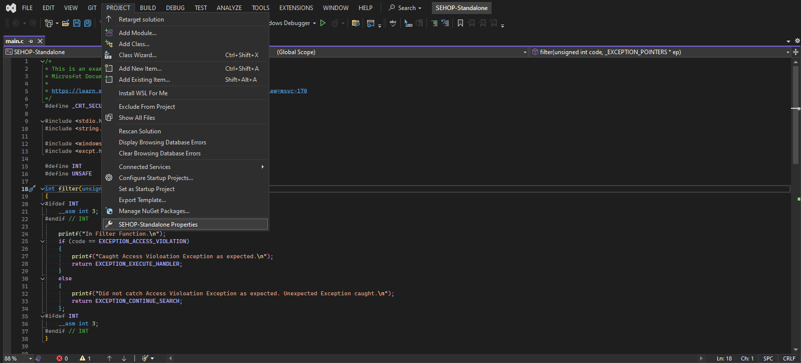

3. Open `Linker` -> `Advanced` and modify the *Image Has Safe Exception Handlers* option

    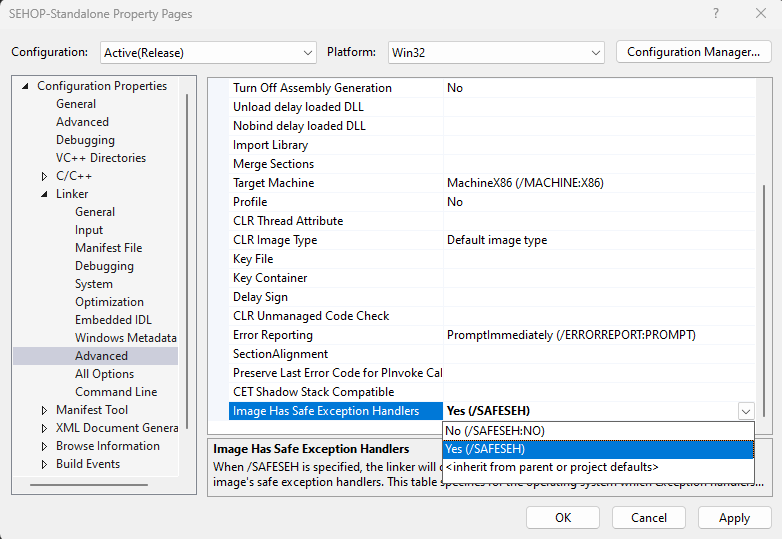

4. Re-Build the project

> [!NOTE]
> You can use the [*msvc*](https://learn.microsoft.com/en-us/cpp/build/reference/compiling-a-c-cpp-program?view=msvc-170) compiler though the command line tool `cl` and the linker with `link`. Using the `/SAFESEH` flag with the linker we can generate a executable with the SafeSEH table.


## Examine SafeSeh
Using the `dumpbin` command line tool, we can examine the *Safe Exception Handler* table of an image that has been created with the `/SAFESEH` compiler flag. 

1. Open the *Developer Powershell for VS 2022*.

    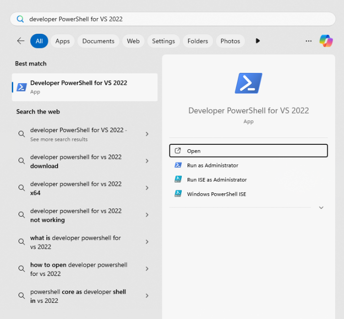

2. Navigate to the location you are storing the executable file we are examining.

3. Use `dumpbin` with the `/LOADCONFIG` flag to print the `IMAGE_LOAD_CONFIG_DIRECTORY` structure which will also print out the *Safe Exception Handler Table*.
    ```
    dumpbin /LOADCONFIG <file>.exe
    ```

4. Examine the *Safe Exception Handler Table*

    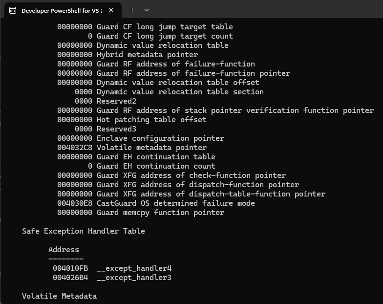

5. Recompile the program with the `/SAFESEH:NO` flag. Can you find the *Safe Exception Handler Table*?

## References
[[1] Preventing the Exploitation of Structured Exception Handler (SEH) Overwrites with SEHOP](https://msrc-blog.microsoft.com/2009/02/02/preventing-the-exploitation-of-structured-exception-handler-seh-overwrites-with-sehop/)

[[2] How to enable Structured Exception Handling Overwrite Protection (SEHOP) in Windows operating systems](https://support.microsoft.com/en-us/topic/how-to-enable-structured-exception-handling-overwrite-protection-sehop-in-windows-operating-systems-8d4595f7-827f-72ee-8c34-fa8e0fe7b915)

[[3] Bypassing SEHOP](http://index-of.es/EBooks/sehop_en.pdf)

[[4] Stack Based Buffer Overflows Structured Exception Handler (SEH) Part 2](https://memn0ps.github.io/windows-user-mode-exploit-development-seh-part-2/)

[[5] Structured Exception Handling (C/C++)](https://learn.microsoft.com/en-us/cpp/cpp/structured-exception-handling-c-cpp?view=msvc-170)

[[6] Undocumented 32-bit PEB and TEB Structures](https://bytepointer.com/resources/tebpeb32.htm)

[[7] How arbitrary is the ArbitraryUserPointer in the TEB](https://devblogs.microsoft.com/oldnewthing/20190418-00/?p=102428)

[[8] struct NT_TIB](https://www.nirsoft.net/kernel_struct/vista/NT_TIB.html)

[[9] The Basics of Exploit Development 2: SEH Overflows](https://coalfire.com/the-coalfire-blog/the-basics-of-exploit-development-2-seh-overflows)

[[10] Struct windows::Win32::System::Kernel::NT_TIB](https://microsoft.github.io/windows-docs-rs/doc/windows/Win32/System/Kernel/struct.EXCEPTION_REGISTRATION_RECORD.html)

[[11] Windows Exploit Development – Part 6: SEH Exploits](https://www.securitysift.com/windows-exploit-development-part-6-seh-exploits/)

[[12] __CxxFrameHandler](https://learn.microsoft.com/en-us/cpp/c-runtime-library/cxxframehandler?view=msvc-170)

[[13] EXCEPTION_RECORD structure](https://learn.microsoft.com/en-us/windows/win32/api/winnt/ns-winnt-exception_record)

[[14] try-except statemen](https://learn.microsoft.com/en-us/cpp/cpp/try-except-statement?view=msvc-170)

[[15] Clearing up Windows SEH exploitation](https://richard-ac.github.io/posts/SEH/) <!-- Why POP POP RET is required-->

[[16] /SAFESEH (Image has Safe Exception Handlers)](https://learn.microsoft.com/en-us/cpp/build/reference/safeseh-image-has-safe-exception-handlers?view=msvc-170)

[[17] .SAFESEH (32-bit MASM)](https://learn.microsoft.com/en-us/cpp/assembler/masm/dot-safeseh?view=msvc-170)

<!-- ## Additional Sources
#### SEHOP
1. Audit: https://www.tenable.com/audits/items/CIS_MS_Windows_8.1_Level_1_v2.3.0.audit:a60f0e83af1c7db1725fdf54597106e6
2. Option: https://learn.microsoft.com/en-us/windows/security/operating-system-security/device-management/override-mitigation-options-for-app-related-security-policies
3. https://support.microsoft.com/en-us/topic/how-to-enable-structured-exception-handling-overwrite-protection-sehop-in-windows-operating-systems-8d4595f7-827f-72ee-8c34-fa8e0fe7b915
#### What is SEH
1. https://coalfire.com/the-coalfire-blog/the-basics-of-exploit-development-2-seh-overflows
2. https://www.ired.team/offensive-security/code-injection-process-injection/binary-exploitation/seh-based-buffer-overflow
3. https://learn.microsoft.com/en-us/cpp/cpp/structured-exception-handling-c-cpp?view=msvc-170
4. https://devblogs.microsoft.com/dotnet/how-clr-maps-seh-exceptions-to-managed-exception-types/
   1. https://learn.microsoft.com/en-us/windows/win32/debug/structured-exception-handling-structures
   2. https://learn.microsoft.com/en-us/windows/win32/debug/structured-exception-handling?redirectedfrom=MSDN -->

